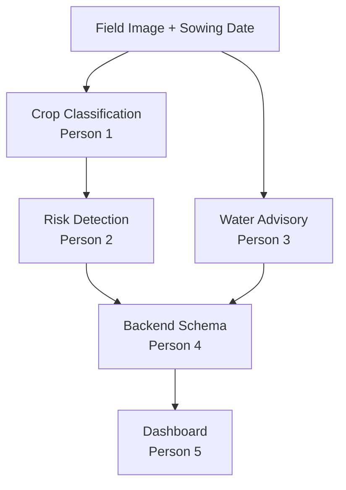

# Crop Health Risk Detection — SIH26131

**Smart India Hackathon 2025 | Problem Statement SIH26131**
Early detection and management of crop diseases and pest infestations

**Theme:** Agriculture, FoodTech & Rural Development
**PS Category:** Software
**Organization:** Government of Maharashtra
**Team:** GCPC

---

## Problem Statement

Farmers often detect crop diseases and pest infestations too late, leading to avoidable
yield loss. This project builds an image-first, AI-powered decision support system that
detects early disease/pest risk from crop images and gives farmers timely, confidence-aware
advisory — not just a label, but a recommended action.

## Team Structure
| Person | Name | Module | Branch |
|---|---|---|---|
| Person 1 | Yug Goel | Crop Classification | `person1-classification` |
| Person 2 | Purusharth Tyagi | Crop Health Risk Detection (AI/ML engine) | `person2-remote-sensing` |
| Person 3 | Abhinav Jha | Water / Irrigation Advisory | `person3-water-advisory` |
| Person 4 | Moulik Dheer | Backend & Schema Integration | `person4-backend` |
| Person 5 | Tanishka Valecha | Dashboard | `person5-dashboard` |
| Person 6 | Avnii Nirwan | Presentation (PPT) | — |

## Architecture Overview

